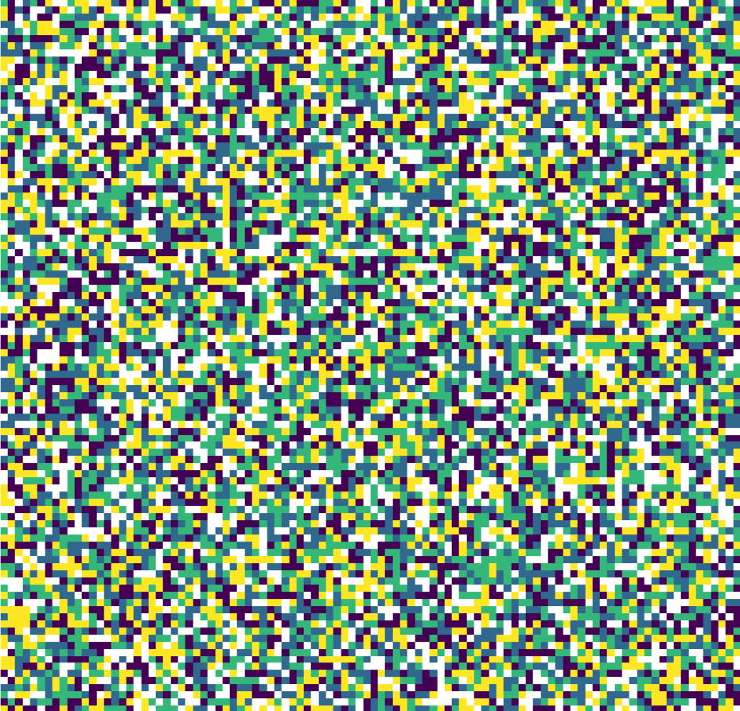
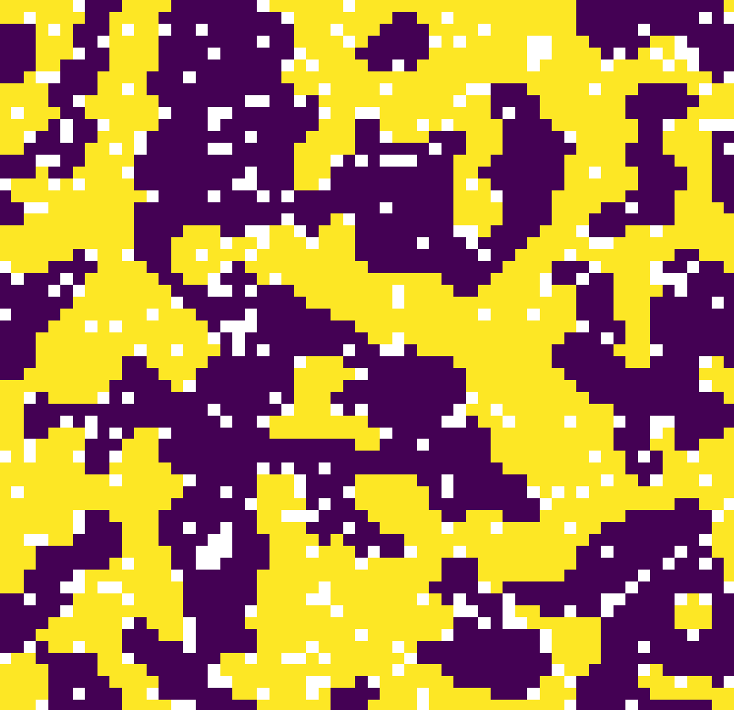
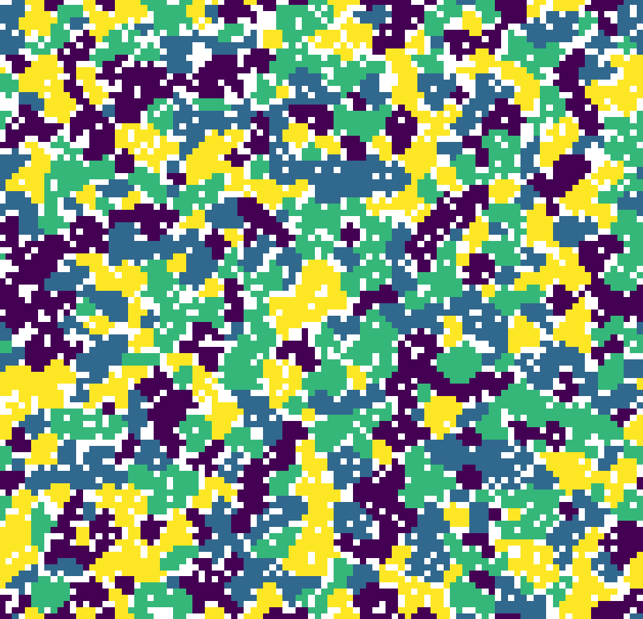

# Interactive Schelling Model of Segregation

  

**The code can be run online using this link:** https://share.streamlit.io/alex180500/schelling-model/main/schelling-model.py

This repository is the base of a [**Streamlit**](https://streamlit.io) Python applet made as a small project for the *Computational Physics with Laboratory* course held in [*Università degli Studi di Palermo*](https://www.unipa.it) by professor *Grazia Cottone* and professor *Salvatore Miccichè*.

Special thanks to professor **Salvatore Miccichè** for the lesson on [Agent-Based Models](https://en.wikipedia.org/wiki/Agent-based_model).

All of the code is distributed under the [MIT License](LICENSE.md) and is free to use for any purpose, please credit me if possible.

## References

The code is based on this amazing article by [**Adil Moujahid**](http://adilmoujahid.com/posts/2020/05/streamlit-python-schelling). Another important reference is the amazing [Streamlit documentation](https://docs.streamlit.io).

## Dependencies

If you want to run the code locally make sure to have the following packages:
  * **Python 3**
  * **Matplotlib**
  * **Numpy**
  * **Streamlit**